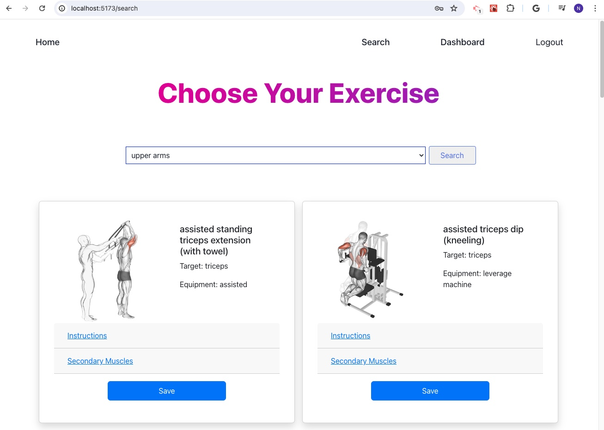
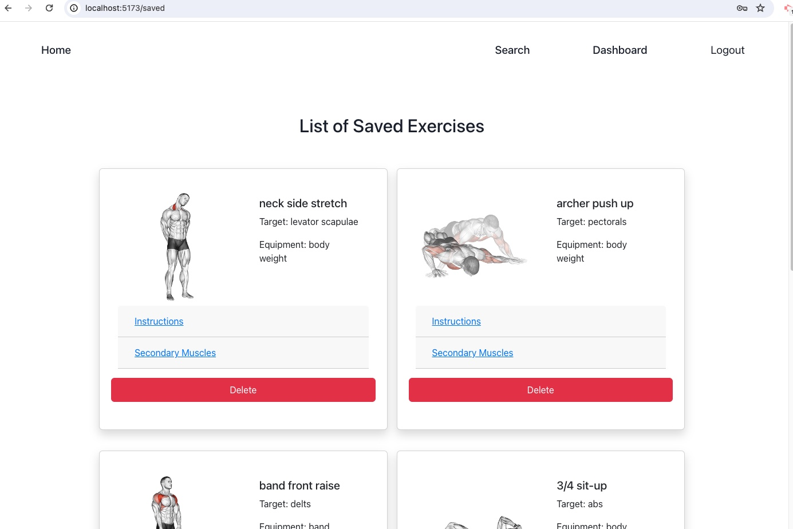

# exerciseXpert-MERN

## Find your favorite exercise by body part in MERN.

## Screenshots

<p align="center">
  
  
    
</p>

## Table of Contents

- [User Story](#user-story)
- [Acceptance Criteria](#acceptance-criteria)
- [Technologies Used](#technologies-used)
- [Deploy Link](#deploy-link)
- [Installation](#installation)

## User Story

```md
As an fitness enthusiast, I want to find different exercises based on body part names
so that I can tailor my workouts effectively.
```

## Acceptance Criteria

```md
WHEN I open the exerciseXpert webpage
AND I see the sign up and login options in navbar
THEN I view the homepage with parallax scrolling

WHEN I click on sign up on navbar
THEN I can view the sign up form

WHEN I submit the sign up form
THEN I am taken to Login in Form page

WHEN I submit the Login Form 
THEN I am taken to the homepage and view the Search and Dashboard in navbar

WHEN I click on Search
THEN I view a dropdown to select a body part name

WHEN I select a body part name
AND I click on the search button
THEN I view a list of exercises for that specific body part

WHEN I click the save button on any exercise card
THEN I see an alert indicating the exercise has been saved successfully in database

WHEN I click the save button again on the same exercise card
THEN I view an alert saying it is already saved in database

WHEN I navigate to the Dashboard page
THEN I view a list of exercises I have saved, each with a delete button

WHEN I click the delete button on any saved exercise card
THEN that specific card is removed from the list of saved exercises in database
```

## Technologies Used

- MongoDB : to store data in flexible, JSON like documents
- Express.js
- React
- React Hooks: useState, useEffect, and useContext (to get savedExercises to other page/component and being able to delete)
- Node.js
- exercise DB API (extract data for exercises based on body part name and also body parts lists)
- Jason Web Token (JWT) for Authentication
- Bcryptjs to hash the passwords
- Chakra UI as Component Library for React
- Dotenv
- Parallax Scrolling
- Bootstrap

## Deploy Link

- Github Repo URL: https://github.com/Najiba-Haidari/haidari_najiba_exerciseXpert_capstone
- Deployed URL: https://haidari-najiba-exercisexpert-capstone-1.onrender.com/ 

## Installation

* Fork the respository
    * In Client
        * npm instal
        * npm run dev
        * open http://localhost:5173/ in your browser
    * in Server
        * npm install
        * noder server.js
        * use this port http://localhost:3000 in Postman/Insomnia/Browser
* And / or 
    * Just visit the deployed link
